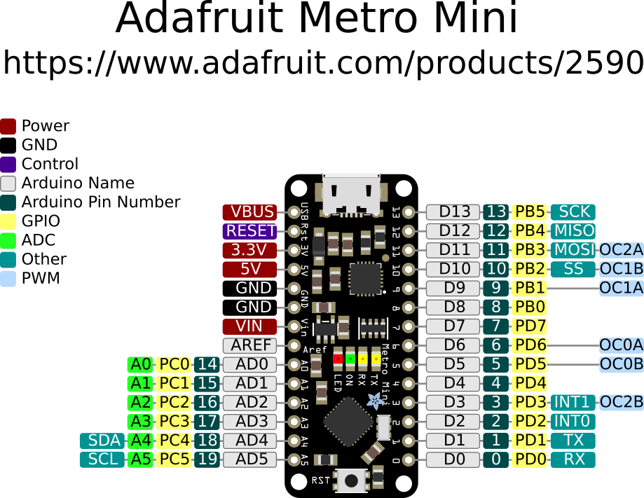
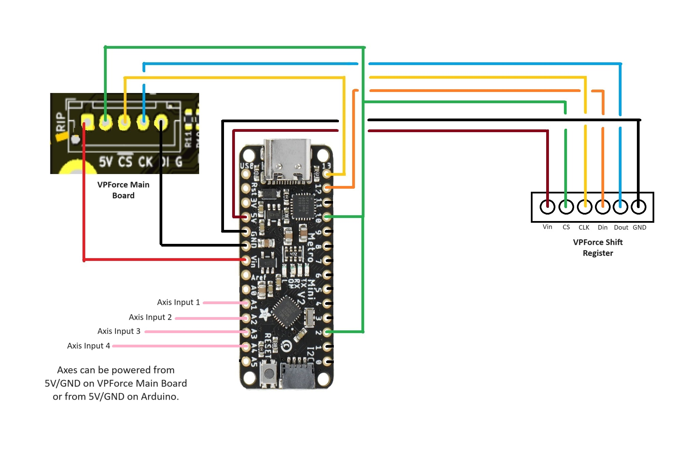

# README
This functionality is under construction.
# Functionality
2 axes, 14 buttons built using the Adafruit MetroMini but will work with other Arduino UNO clones/derivatives
***

# WIRING DIAGRAM/SCHEMATIC

